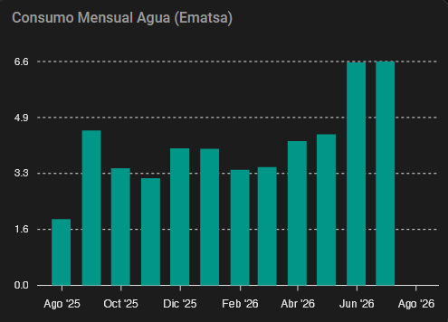
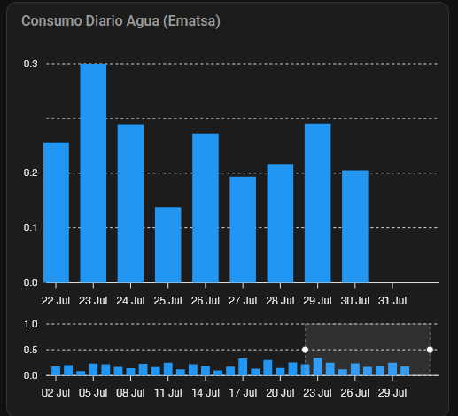

# 💧 Ematsa - Home Assistant

[Català](#-català) | [Español](#-español) | [English](#-english)

---

## 🌍 Català

Integració personalitzada per obtenir dades de consum d'aigua des de l'oficina virtual d'Ematsa (Tarragona) a Home Assistant.

### Instal·lació Ràpida (HACS)

Pots afegir aquesta integració directament al teu HACS fent clic al botó següent:

[](https://my.home-assistant.io/redirect/hacs_repository/?owner=gerard-marti&repository=ha-ematsa&category=integration)

### Instal·lació Manual (Pas a Pas)

1. Obre Home Assistant i ves a la pestanya **HACS**.
2. Clica a **Integracions**.
3. Clica als tres punts (a dalt a la dreta) i selecciona **Repositoris personalitzats**.
4. Enganxa la URL d'aquest repositori (`https://github.com/gerard-marti/ha-ematsa`), tria la categoria **Integració** i clica **Afegir**.
5. Cerca "Ematsa" a HACS, fes clic a **Descarregar** i reinicia Home Assistant.
6. Un cop reiniciat, ves a **Configuració > Dispositius i serveis > Afegir integració** i cerca "Ematsa".
7. Introdueix el teu usuari, contrasenya i número de contracte.

### 📊 Entitats Generades

* `sensor.ematsa_<contracte>_lectura_contador` (Lectura acumulada en m³)
* `sensor.ematsa_<contracte>_consumo_mes_actual` (Consum del mes en curs en m³)
* `sensor.ematsa_<contracte>_consumo_ultimo_mes` (Consum del mes anterior en m³)
* `button.ematsa_<contracte>_actualizar_datos` (Botó de refresc manual)

### 📈 Targeta d'Exemple (Mensual)

Per mostrar el gràfic de barres mensual amb el consum **directament en litres** en passar el cursor, necessites la targeta [apexcharts-card](https://github.com/RomRider/apexcharts-card) (disponible a HACS).

> **Nota:** Canvia `num-contract` pel teu número de contracte.

```yaml
type: custom:apexcharts-card
graph_span: 12month
span:
  end: month
header:
  show: true
  title: Consum Mensual Aigua (Ematsa)
  show_states: false
apex_config:
  tooltip:
    y:
      formatter: |
        EVAL:function(val) {
          if (val === null || val === undefined) return '';
          const litros = Math.round(val * 1000).toLocaleString('es-ES');
          return litros + ' L';
        }
yaxis:
  - min: 0
    apex_config:
      forceNiceScale: true
all_series_config:
  type: column
  unit: m³
series:
  - entity: sensor.ematsa_num-contract_lectura_contador
    name: Consum Mensual
    color: "#009688"
    data_generator: |
      const historico = entity.attributes.historico_mensual;
      if (!historico) return [];
      
      return historico.map((item) => {
        const timestamp = new Date(item.fecha).getTime();
        return [timestamp, item.consumo];
      });
```

### 📈 Targeta d'Exemple (Diària)

Aquesta targeta mostra l'històric dels últims 30 dies i inclou un selector interactiu (brush) per fer zoom als últims 10 dies.
> **Nota:** Canvia `num-contract` pel teu número de contracte.

```yaml
type: custom:apexcharts-card
graph_span: 30d
span:
  end: day
experimental:
  brush: true
header:
  show: true
  title: Consum Diari Aigua (Ematsa)
  show_states: false
brush:
  selection_span: 10d
apex_config:
  tooltip:
    y:
      formatter: |
        EVAL:function(val) {
          if (val === null || val === undefined) return '';
          const litros = Math.round(val * 1000).toLocaleString('es-ES');
          return litros + ' L';
        }
yaxis:
  - min: 0
    apex_config:
      forceNiceScale: true
all_series_config:
  type: column
  unit: m³
series:
  - entity: sensor.ematsa_num-contract_lectura_contador
    name: Consum Diari
    color: "#2196f3"
    show:
      in_chart: true
      in_brush: true
    data_generator: |
      if (!entity || !entity.attributes || !entity.attributes.historico_diario) return [];
      const historico = entity.attributes.historico_diario;
      if (!Array.isArray(historico)) return [];

      const data = [];
      for (const item of historico) {
        if (!item || !item.fecha) continue;
        const partes = item.fecha.split('-');
        let timestamp;

        if (partes.length === 3) {
          timestamp = new Date(partes[0], partes[1] - 1, partes[2]).getTime();
        } else {
          timestamp = new Date(item.fecha).getTime();
        }

        if (!isNaN(timestamp)) {
          data.push([timestamp, Number(item.consumo) || 0]);
        }
      }
      return data;
```


---

## 🇪🇸 Español

Integración personalizada para obtener datos de consumo de agua desde la oficina virtual de Ematsa (Tarragona) en Home Assistant.

### Instalación Rápida (HACS)

Puedes añadir esta integración directamente a tu HACS haciendo clic en el siguiente botón:

[](https://my.home-assistant.io/redirect/hacs_repository/?owner=gerard-marti&repository=ha-ematsa&category=integration)

### Instalación Manual (Paso a Paso)

1. Abre Home Assistant y ve a la pestaña **HACS**.
2. Haz clic en **Integraciones**.
3. Haz clic en los tres puntos (arriba a la derecha) y selecciona **Repositorios personalizados**.
4. Pega la URL de este repositorio (`https://github.com/gerard-marti/ha-ematsa`), elige la categoría **Integración** y haz clic en **Añadir**.
5. Busca "Ematsa" en HACS, haz clic en **Descargar** y reinicia Home Assistant.
6. Una vez reiniciado, ve a **Ajustes > Dispositivos y servicios > Añadir integración** y busca "Ematsa".
7. Introduce tu usuario, contraseña y número de contrato.

### 📊 Entidades Generadas

* `sensor.ematsa_<contrato>_lectura_contador` (Lectura acumulada en m³)
* `sensor.ematsa_<contrato>_consumo_mes_actual` (Consumo del mes en curso en m³)
* `sensor.ematsa_<contrato>_consumo_ultimo_mes` (Consumo del mes anterior en m³)
* `button.ematsa_<contrato>_actualizar_datos` (Botón de refresco manual)

### 📈 Tarjeta de Ejemplo (Mensual)

Para renderizar el gráfico mensual de barras mostrando el consumo **directamente en litros** al pasar el cursor, necesitas la tarjeta [apexcharts-card](https://github.com/RomRider/apexcharts-card) (disponible en HACS).

> **Nota:** Reemplaza `num-contract` en el nombre de la entidad por tu número de contrato.

```yaml
type: custom:apexcharts-card
graph_span: 12month
span:
  end: month
header:
  show: true
  title: Consumo Mensual Agua (Ematsa)
  show_states: false
apex_config:
  tooltip:
    y:
      formatter: |
        EVAL:function(val) {
          if (val === null || val === undefined) return '';
          const litros = Math.round(val * 1000).toLocaleString('es-ES');
          return litros + ' L';
        }
yaxis:
  - min: 0
    apex_config:
      forceNiceScale: true
all_series_config:
  type: column
  unit: m³
series:
  - entity: sensor.ematsa_num-contract_lectura_contador
    name: Consumo Mensual
    color: "#009688"
    data_generator: |
      const historico = entity.attributes.historico_mensual;
      if (!historico) return [];
      
      return historico.map((item) => {
        const timestamp = new Date(item.fecha).getTime();
        return [timestamp, item.consumo];
      });
```

### 📈Tarjeta de Ejemplo (Diaria)

Esta tarjeta muestra el histórico de los últimos 30 días e incluye un selector interactivo (brush) para hacer zoom a los últimos 10 días.
> **Nota:** Reemplaza `num-contract` en el nombre de la entidad por tu número de contrato.

```yaml
type: custom:apexcharts-card
graph_span: 30d
span:
  end: day
experimental:
  brush: true
header:
  show: true
  title: Consumo Diario Agua (Ematsa)
  show_states: false
brush:
  selection_span: 10d
apex_config:
  tooltip:
    y:
      formatter: |
        EVAL:function(val) {
          if (val === null || val === undefined) return '';
          const litros = Math.round(val * 1000).toLocaleString('es-ES');
          return litros + ' L';
        }
yaxis:
  - min: 0
    apex_config:
      forceNiceScale: true
all_series_config:
  type: column
  unit: m³
series:
  - entity: sensor.ematsa_num-contract_lectura_contador
    name: Consum Diari
    color: "#2196f3"
    show:
      in_chart: true
      in_brush: true
    data_generator: |
      if (!entity || !entity.attributes || !entity.attributes.historico_diario) return [];
      const historico = entity.attributes.historico_diario;
      if (!Array.isArray(historico)) return [];

      const data = [];
      for (const item of historico) {
        if (!item || !item.fecha) continue;
        const partes = item.fecha.split('-');
        let timestamp;

        if (partes.length === 3) {
          timestamp = new Date(partes[0], partes[1] - 1, partes[2]).getTime();
        } else {
          timestamp = new Date(item.fecha).getTime();
        }

        if (!isNaN(timestamp)) {
          data.push([timestamp, Number(item.consumo) || 0]);
        }
      }
      return data;
```

---

## 🇬🇧 English

Custom integration to fetch water consumption data from the Ematsa virtual office (Tarragona) in Home Assistant.

### Quick Installation (HACS)

You can add this integration directly to your HACS by clicking the following button:

[](https://my.home-assistant.io/redirect/hacs_repository/?owner=gerard-marti&repository=ha-ematsa&category=integration)

### Manual Installation (Step by Step)

1. Open Home Assistant and go to the **HACS** tab.
2. Click on **Integrations**.
3. Click the three dots (top right) and select **Custom repositories**.
4. Paste this repository's URL (`https://github.com/gerard-marti/ha-ematsa`), choose the **Integration** category and click **Add**.
5. Search for "Ematsa" in HACS, click **Download** and restart Home Assistant.
6. Once restarted, go to **Settings > Devices & Services > Add Integration** and search for "Ematsa".
7. Enter your username, password, and contract number.

### 📊 Generated Entities

* `sensor.ematsa_<contract>_lectura_contador` (Total reading in m³)
* `sensor.ematsa_<contract>_consumo_mes_actual` (Current month consumption in m³)
* `sensor.ematsa_<contract>_consumo_ultimo_mes` (Previous month consumption in m³)
* `button.ematsa_<contract>_actualizar_datos` (Manual refresh button)

### 📈 Example Card (Monthly)

To render the monthly bar chart showing consumption **directly in liters** on hover, you need the [apexcharts-card](https://github.com/RomRider/apexcharts-card) (available in HACS).

> **Note:** Replace `num-contract` in the entity name with your contract number.

```yaml
type: custom:apexcharts-card
graph_span: 12month
span:
  end: month
header:
  show: true
  title: Monthly Water Consumption (Ematsa)
  show_states: false
apex_config:
  tooltip:
    y:
      formatter: |
        EVAL:function(val) {
          if (val === null || val === undefined) return '';
          const litros = Math.round(val * 1000).toLocaleString('es-ES');
          return litros + ' L';
        }
yaxis:
  - min: 0
    apex_config:
      forceNiceScale: true
all_series_config:
  type: column
  unit: m³
series:
  - entity: sensor.ematsa_num-contract_lectura_contador
    name: Monthly Consumption
    color: "#009688"
    data_generator: |
      const historico = entity.attributes.historico_mensual;
      if (!historico) return [];
      
      return historico.map((item) => {
        const timestamp = new Date(item.fecha).getTime();
        return [timestamp, item.consumo];
      });
```


### 📈 Example Card (Daily)

This card shows the consumption history for the last 30 days and includes an interactive brush selector to zoom into the last 10 days.
> **Note:** Replace `num-contract` in the entity name with your contract number.

```yaml
type: custom:apexcharts-card
graph_span: 30d
span:
  end: day
experimental:
  brush: true
header:
  show: true
  title: Daily Water Consumption (Ematsa)
  show_states: false
brush:
  selection_span: 10d
apex_config:
  tooltip:
    y:
      formatter: |
        EVAL:function(val) {
          if (val === null || val === undefined) return '';
          const litros = Math.round(val * 1000).toLocaleString('es-ES');
          return litros + ' L';
        }
yaxis:
  - min: 0
    apex_config:
      forceNiceScale: true
all_series_config:
  type: column
  unit: m³
series:
  - entity: sensor.ematsa_num-contract_lectura_contador
    name: Daily Consumption
    color: "#2196f3"
    show:
      in_chart: true
      in_brush: true
    data_generator: |
      if (!entity || !entity.attributes || !entity.attributes.historico_diario) return [];
      const historico = entity.attributes.historico_diario;
      if (!Array.isArray(historico)) return [];

      const data = [];
      for (const item of historico) {
        if (!item || !item.fecha) continue;
        const partes = item.fecha.split('-');
        let timestamp;

        if (partes.length === 3) {
          timestamp = new Date(partes[0], partes[1] - 1, partes[2]).getTime();
        } else {
          timestamp = new Date(item.fecha).getTime();
        }

        if (!isNaN(timestamp)) {
          data.push([timestamp, Number(item.consumo) || 0]);
        }
      }
      return data;
```
